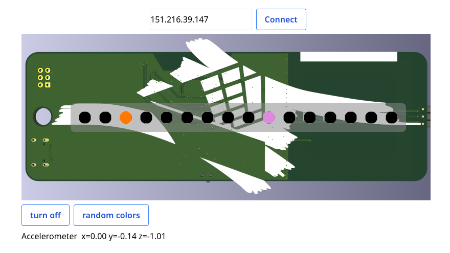

# Bornhack Badge 2024

This is a "full-stack" Rust codebase that runs a webserver with websockets on the board.

Originally we served the frontend from the board. This worked fine on our home wifi, but not on the BornHack wifi due to weird network issues. Instead we serve the frontend separately and only connect via websockets to the board.

You can try it on https://badge.pwnies.dk (or http://128.140.95.229/ if it doesn't work due to TLS issues),
or by running `trunk serve` from the repository root.

## Commands:

Run `trunk build --release` to generate the needed `dist/` directory for `apps/feature-creep` to compile.

Run `./run_web.sh` to run the web example.

Run `./run.sh <example_name>` to run an example.