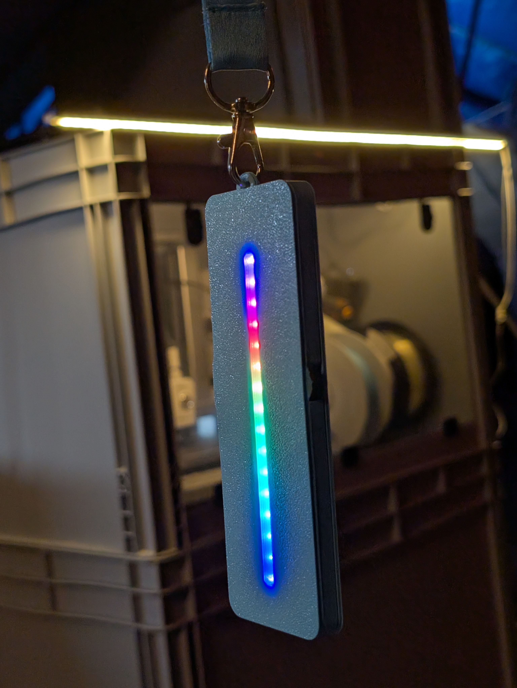
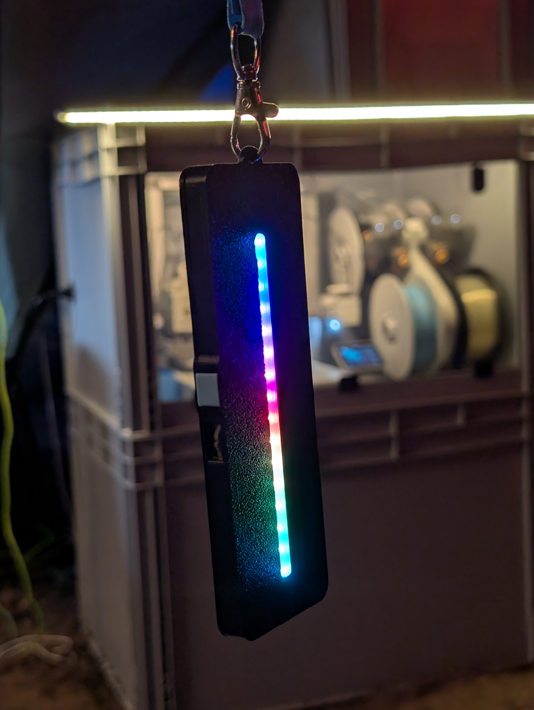

# Bornhack 2024 Badge Case

The badge was created using FreeCAD 1.0.1 and exported as four separate STL files.
<p float="left">


</p>

## Printing
The case is designed with a window on the front, and so I highly recommend printing the `LedWindow` file using transparent or white filament. All the parts should be printable without support material, but remember to flip the `MainPart`.

## Assembly
The assembly process is fairly straightforward:
1. Put the `WindowInsert` into the `MainPart`
2. Put your 2024 Bornhack badge PCB into the `MainPart`
3. Put the `PowerSwitch` in (mind the power switch position to avoid crushing it!)
4. Put the `Lid` on
5. ???
6. Profit

Here is a top to bottom diagram:
```
    Lid
     |
     V
PowerSwitch
     |
     V
  Badge PCB
     |
     V
WindowInsert
     |
     V
  MainPart
```
