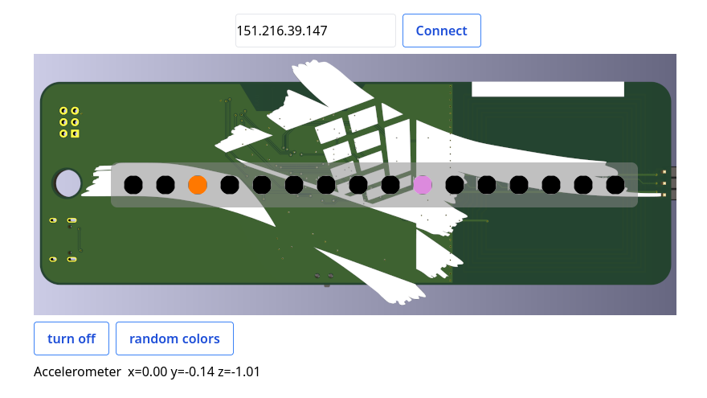

# Bornhack Badge 2024

This is a "full-stack" Rust codebase that runs a webserver with websockets on the board.

## Commands:

Run `trunk build --release` to generate the needed `dist/` directory for `feature-creep` to compile.

Run `./run.sh` to flash the board.